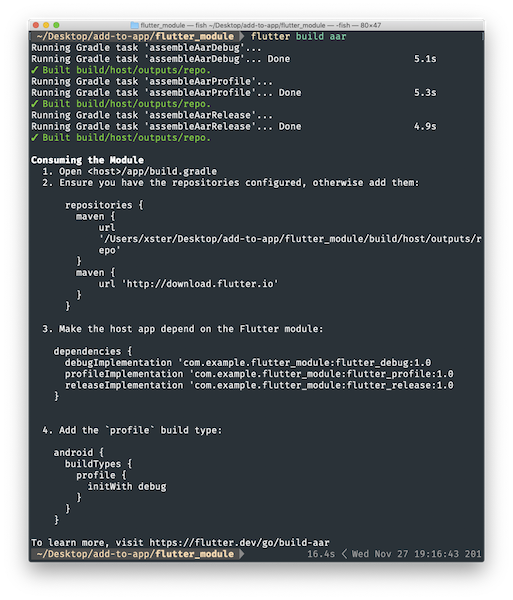
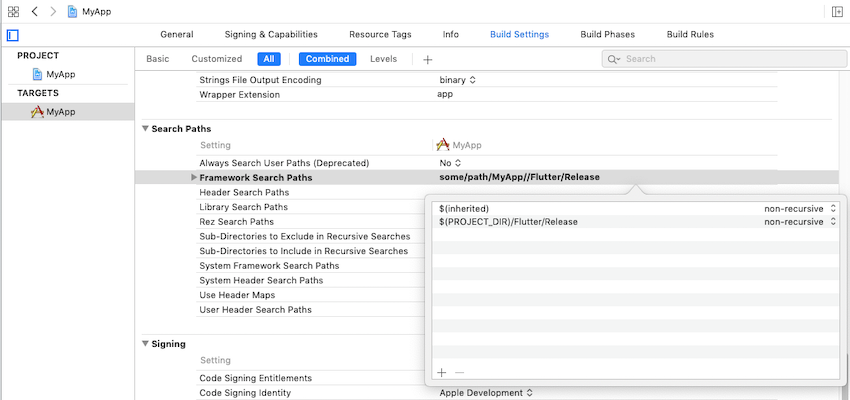
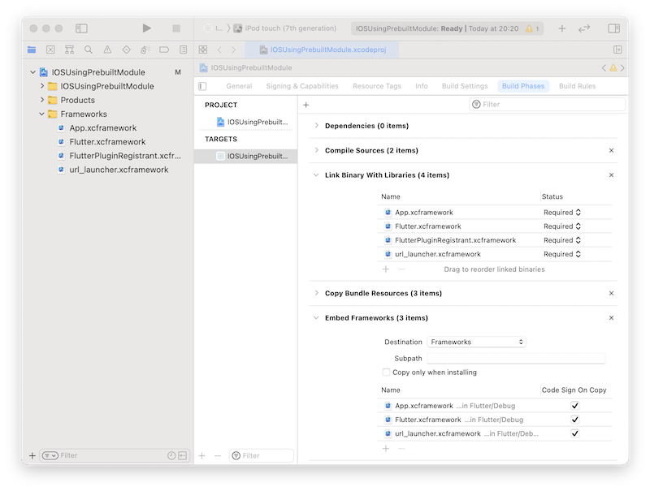
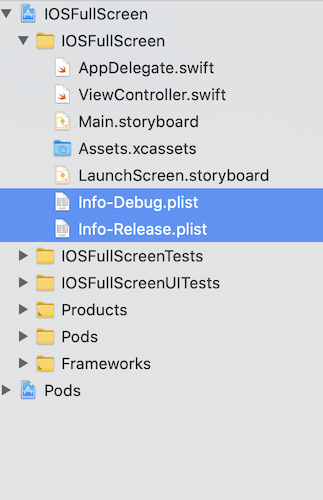
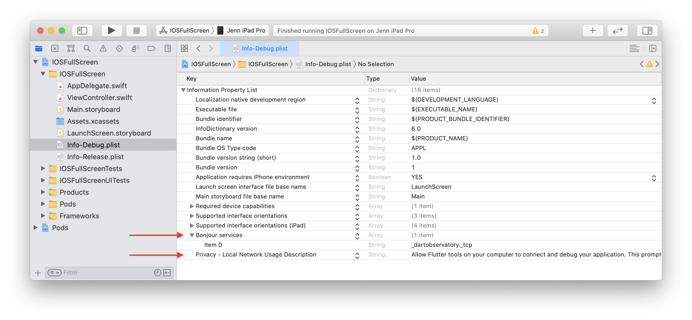
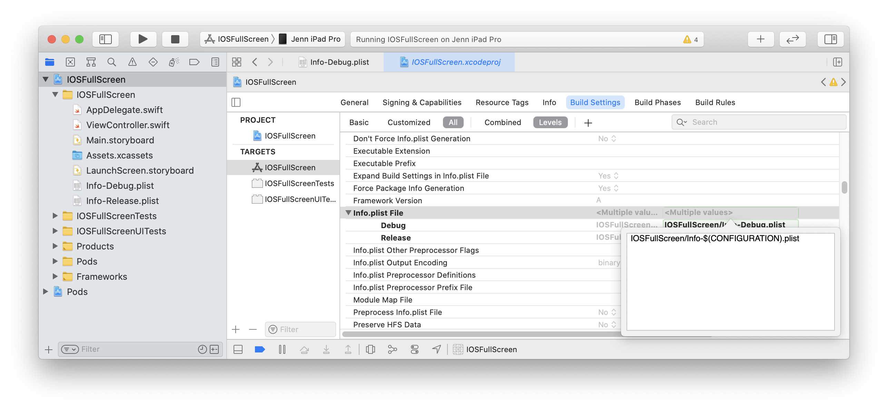
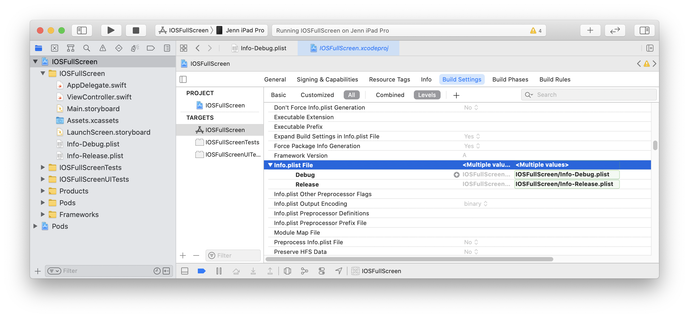
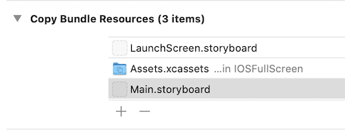
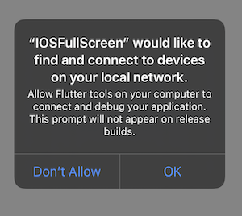
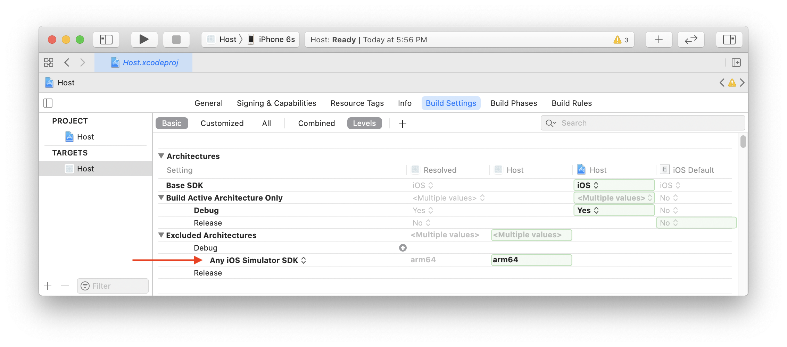

# flutter_offerwall_module

A new Flutter module project.

# Getting Started

## Docs flutter module

- [documentation android](https://docs.flutter.dev/add-to-app/android/project-setup?tab=with-android-studio).

- [documentation ios](https://docs.flutter.dev/add-to-app/ios/project-setup).

## Android

### Step 1: Build AAR

```
    flutter build aar
```



- More specifically, this command creates (by default all debug/profile/release modes) a local repository, with the following files:

```
build/host/outputs/repo
└── com
    └── example
        └── flutter_module
            ├── flutter_release
            │   ├── 1.0
            │   │   ├── flutter_release-1.0.aar
            │   │   ├── flutter_release-1.0.aar.md5
            │   │   ├── flutter_release-1.0.aar.sha1
            │   │   ├── flutter_release-1.0.pom
            │   │   ├── flutter_release-1.0.pom.md5
            │   │   └── flutter_release-1.0.pom.sha1
            │   ├── maven-metadata.xml
            │   ├── maven-metadata.xml.md5
            │   └── maven-metadata.xml.sha1
            ├── flutter_profile
            │   ├── ...
            └── flutter_debug
                └── ...

```

- To depend on the AAR, the host app must be able to find these files. To do that, edit app/build.gradle in your host app so that it includes the local repository and the dependency:

```
android {
  // ...
}

repositories {
  maven {
    url 'some/path/flutter_module/build/host/outputs/repo'
    // This is relative to the location of the build.gradle file
    // if using a relative path.
  }
  maven {
    url 'https://storage.googleapis.com/download.flutter.io'
  }
}

dependencies {
  // ...
  debugImplementation 'com.example.flutter_module:flutter_debug:1.0'
  profileImplementation 'com.example.flutter_module:flutter_profile:1.0'
  releaseImplementation 'com.example.flutter_module:flutter_release:1.0'
}
```
### Step 2: Add a normal Flutter screen

- Add FlutterActivity to AndroidManifest.xml
  
Flutter provides FlutterActivity to display a Flutter experience within an Android app. Like any other Activity, FlutterActivity must be registered in your AndroidManifest.xml. Add the following XML to your AndroidManifest.xml file under your application tag:

```
<activity
  android:name="io.flutter.embedding.android.FlutterActivity"
  android:theme="@style/LaunchTheme"
  android:configChanges="orientation|keyboardHidden|keyboard|screenSize|locale|layoutDirection|fontScale|screenLayout|density|uiMode"
  android:hardwareAccelerated="true"
  android:windowSoftInputMode="adjustResize"
  />
```
The reference to @style/LaunchTheme can be replaced by any Android theme that want to apply to your FlutterActivity. The choice of theme dictates the colors applied to Android’s system chrome, like Android’s navigation bar, and to the background color of the FlutterActivity just before the Flutter UI renders itself for the first time.


- Launch FlutterActivity
  
With FlutterActivity registered in your manifest file, add code to launch FlutterActivity from whatever point in your app that you’d like. The following example shows FlutterActivity being launched from an OnClickListener.
```
import io.flutter.embedding.android.FlutterActivity;
```
```
//kotlin
myButton.setOnClickListener {
  startActivity(
    FlutterActivity.createDefaultIntent(this)
  )
}
//java
myButton.setOnClickListener(new OnClickListener() {
  @Override
  public void onClick(View v) {
    startActivity(
      FlutterActivity.createDefaultIntent(currentActivity)
    );
  }
});
```

The previous example assumes that your Dart entrypoint is called main(), and your initial Flutter route is ‘/’. The Dart entrypoint can’t be changed using Intent, but the initial route can be changed using Intent. The following example demonstrates how to launch a FlutterActivity that initially renders a custom route in Flutter.
```
//kotlin
myButton.setOnClickListener {
  startActivity(
    FlutterActivity
      .withNewEngine()
      .initialRoute("/my_route")
      .build(this)
  )
}
//java
myButton.addOnClickListener(new OnClickListener() {
  @Override
  public void onClick(View v) {
    startActivity(
      FlutterActivity
        .withNewEngine()
        .initialRoute("/my_route")
        .build(currentActivity)
      );
  }
});
```
Replace "/my_route" with your desired initial route.

The use of the withNewEngine() factory method configures a FlutterActivity that internally create its own FlutterEngine instance. This comes with a non-trivial initialization time. The alternative approach is to instruct FlutterActivity to use a pre-warmed, cached FlutterEngine, which minimizes Flutter’s initialization time. That approach is discussed next.

## IOS

Flutter UI components can be incrementally added into your existing iOS application as embedded frameworks. There are a few ways to embed Flutter in your existing application.

Use the CocoaPods dependency manager and installed Flutter SDK. In this case, the flutter_module is compiled from the source each time the app is built. (Recommended.)

Create frameworks for the Flutter engine, your compiled Dart code, and all Flutter plugins. Here, you manually embed the frameworks, and update your existing application’s build settings in Xcode. This can be useful for teams that don’t want to require every developer to have the Flutter SDK and Cocoapods installed locally.

Create frameworks for your compiled Dart code, and all Flutter plugins. Use CocoaPods for the Flutter engine. With this option, embed the frameworks for your application and the plugins in Xcode, but distribute the Flutter engine as a CocoaPods podspec. This is similar to the second option, but it provides an alternative to distributing the large Flutter.xcframework.

For examples using an app built with UIKit, see the iOS directories in the add_to_app code samples. For an example using SwiftUI, see the iOS directory in News Feed App.

### Option A - Embed with CocoaPods and the Flutter SDK

This method requires every developer working on your project to have a locally installed version of the Flutter SDK. The Flutter module is compiled from source each time the app is built. Simply build your application in Xcode to automatically run the script to embed your Dart and plugin code. This allows rapid iteration with the most up-to-date version of your Flutter module without running additional commands outside of Xcode.

The following example assumes that your existing application and the Flutter module are in sibling directories. If you have a different directory structure, you might need to adjust the relative paths.
```
some/path/
├── my_flutter/
│   └── .ios/
│       └── Flutter/
│         └── podhelper.rb
└── MyApp/
    └── Podfile
```
If your existing application (MyApp) doesn’t already have a Podfile, run pod init in the
MyApp directory to create one. You can find more details on using CocoaPods in the CocoaPods getting started guide.

- Add the following lines to your Podfile:

```
flutter_application_path = '../my_flutter'
load File.join(flutter_application_path, '.ios', 'Flutter', 'podhelper.rb')
```

- For each Podfile target that needs to embed Flutter, call install_all_flutter_pods(flutter_application_path).

```
target 'MyApp' do
  install_all_flutter_pods(flutter_application_path)
end
```

- In the Podfile’s post_install block, call flutter_post_install(installer).

```
post_install do |installer|
  flutter_post_install(installer) if defined?(flutter_post_install)
end
```
Note: The flutter_post_install method (added in Flutter 3.1.0), adds build settings to support native Apple Silicon arm64 iOS simulators. Include the if defined?(flutter_post_install) check to ensure your Podfile is valid if you are running on older versions of Flutter that don’t have this method.

- Run pod install.

Note: When you change the Flutter plugin dependencies in my_flutter/pubspec.yaml, run flutter pub get in your Flutter module directory to refresh the list of plugins read by the podhelper.rb script. Then, run pod install again from your application at some/path/MyApp.

The podhelper.rb script embeds your plugins, Flutter.framework, and App.framework into your project.

Your app’s Debug and Release build configurations embed the Debug or Release build modes of Flutter, respectively. Add a Profile build configuration to your app to test in profile mode.

### Option B - Embed frameworks in Xcode

Alternatively, you can generate the necessary frameworks and embed them in your application by manually editing your existing Xcode project. You might do this if members of your team can’t locally install Flutter SDK and CocoaPods, or if you don’t want to use CocoaPods as a dependency manager in your existing applications. You must run flutter build ios-framework every time you make code changes in your Flutter module.

The following example assumes that you want to generate the frameworks to some/path/MyApp/Flutter/.

```
flutter build ios-framework --output=some/path/MyApp/Flutter/
```
```
some/path/MyApp/
└── Flutter/
    ├── Debug/
    │   ├── Flutter.xcframework
    │   ├── App.xcframework
    │   ├── FlutterPluginRegistrant.xcframework (only if you have plugins with iOS platform code)
    │   └── example_plugin.xcframework (each plugin is a separate framework)
    ├── Profile/
    │   ├── Flutter.xcframework
    │   ├── App.xcframework
    │   ├── FlutterPluginRegistrant.xcframework
    │   └── example_plugin.xcframework
    └── Release/
        ├── Flutter.xcframework
        ├── App.xcframework
        ├── FlutterPluginRegistrant.xcframework
        └── example_plugin.xcframework
```
Warning: Always use Flutter.xcframework and App.xcframework from the same directory. Mixing .xcframework imports from different directories (such as Profile/Flutter.xcframework with Debug/App.xcframework) causes runtime crashes.

Link and embed the generated frameworks into your existing application in Xcode. There are multiple ways to do this—use the method that is best for your project.

- Link on the frameworks

For example, you can drag the frameworks from some/path/MyApp/Flutter/Release/ in Finder into your target’s Build Settings > Build Phases > Link Binary With Libraries.

In the target’s build settings, add $(PROJECT_DIR)/Flutter/Release/ to the Framework Search Paths (FRAMEWORK_SEARCH_PATHS).



Tip: To use the simulator, you will need to embed the Debug version of the Flutter frameworks in your Debug build configuration. To do this you can use $(PROJECT_DIR)/Flutter/$(CONFIGURATION) in the Framework Search Paths (FRAMEWORK_SEARCH_PATHS) build setting. This embeds the Release frameworks in the Release configuration, and the Debug frameworks in the Debug Configuration.

You must also open MyApp.xcodeproj/project.pbxproj (from Finder) and replace path = Flutter/Release/example.xcframework; with path = "Flutter/$(CONFIGURATION)/example.xcframework"; for all added frameworks. (Note the added ".)

- Embed the frameworks

The generated dynamic frameworks must be embedded into your app to be loaded at runtime.

Important: Plugins might produce static or dynamic frameworks. Static frameworks should be linked on, but never embedded. If you embed a static framework into your application, your application is not publishable to the App Store and fails with a Found an unexpected Mach-O header code archive error.

After linking the frameworks, you should see them in the Frameworks, Libraries, and Embedded Content section of your target’s General settings. To embed the dynamic frameworks select Embed & Sign.

They will then appear under Embed Frameworks within Build Phases as follows:

You should now be able to build the project in Xcode using ⌘B.

### Option C - Embed application and plugin frameworks in Xcode and Flutter framework with CocoaPods

Alternatively, instead of distributing the large Flutter.xcframework to other developers, machines, or continuous integration systems, you can instead generate Flutter as CocoaPods podspec by adding the flag --cocoapods. This produces a Flutter.podspec instead of an engine Flutter.xcframework. The App.xcframework and plugin frameworks are generated as described in Option B.

To generate the Flutter.podspec and frameworks, run the following from the command line in the root of your Flutter module:

```
flutter build ios-framework --cocoapods --output=some/path/MyApp/Flutter/
```
```
some/path/MyApp/
└── Flutter/
    ├── Debug/
    │   ├── Flutter.podspec
    │   ├── App.xcframework
    │   ├── FlutterPluginRegistrant.xcframework
    │   └── example_plugin.xcframework (each plugin with iOS platform code is a separate framework)
    ├── Profile/
    │   ├── Flutter.podspec
    │   ├── App.xcframework
    │   ├── FlutterPluginRegistrant.xcframework
    │   └── example_plugin.xcframework
    └── Release/
        ├── Flutter.podspec
        ├── App.xcframework
        ├── FlutterPluginRegistrant.xcframework
        └── example_plugin.xcframework
```
Host apps using CocoaPods can add Flutter to their Podfile:
```
pod 'Flutter', :podspec => 'some/path/MyApp/Flutter/[build mode]/Flutter.podspec'
```

Note: You must hard code the [build mode] value. For example, use Debug if you need to use flutter attach and Release when you’re ready to ship.

Link and embed the generated App.xcframework, FlutterPluginRegistrant.xcframework, and any plugin frameworks into your existing application as described in Option B.


## Local Network Privacy Permissions

On iOS 14 and higher, enable the Dart multicast DNS service in the Debug version of your app to add debugging functionalities such as hot-reload and DevTools via flutter attach.

Warning: This service must not be enabled in the Release version of your app, or you might experience App Store rejections.

One way to do this is to maintain a separate copy of your app’s Info.plist per build configuration. The following instructions assume the default Debug and Release. Adjust the names as needed depending on your app’s build configurations.

- Rename your app’s Info.plist to Info-Debug.plist. Make a copy of it called Info-Release.plist and add it to your Xcode project.



- In Info-Debug.plist only add the key NSBonjourServices and set the value to an array with the string _dartVmService._tcp. Note Xcode will display this as “Bonjour services”.

Optionally, add the key NSLocalNetworkUsageDescription set to your desired customized permission dialog text.



- In your target’s build settings, change the Info.plist File (INFOPLIST_FILE) setting path from path/to/Info.plist to path/to/Info-$(CONFIGURATION).plist.



This will resolve to the path Info-Debug.plist in Debug and Info-Release.plist in Release.



Alternatively, you can explicitly set the Debug path to Info-Debug.plist and the Release path to Info-Release.plist.

- If the Info-Release.plist copy is in your target’s Build Settings > Build Phases > Copy Bundle Resources build phase, remove it.



The first Flutter screen loaded by your Debug app will now prompt for local network permission. The permission can also be allowed by enabling Settings > Privacy > Local Network > Your App.



## Apple Silicon (arm64 Macs)

On an Apple Silicon (M1) Mac, the host app builds for an arm64 simulator. While Flutter supports arm64 simulators, some plugins might not. If you use one of these plugins, you might see a compilation error like Undefined symbols for architecture arm64 and you must exclude arm64 from the simulator architectures in your host app.

In your host app target, find the Excluded Architectures (EXCLUDED_ARCHS) build setting. Click the right arrow disclosure indicator icon to expand the available build configurations. Hover over Debug and click the plus icon. Change Any SDK to Any iOS Simulator SDK. Add arm64 to the build settings value.



When done correctly, Xcode will add "EXCLUDED_ARCHS[sdk=iphonesimulator*]" = arm64; to your project.pbxproj file.

Repeat for any iOS unit test targets.

